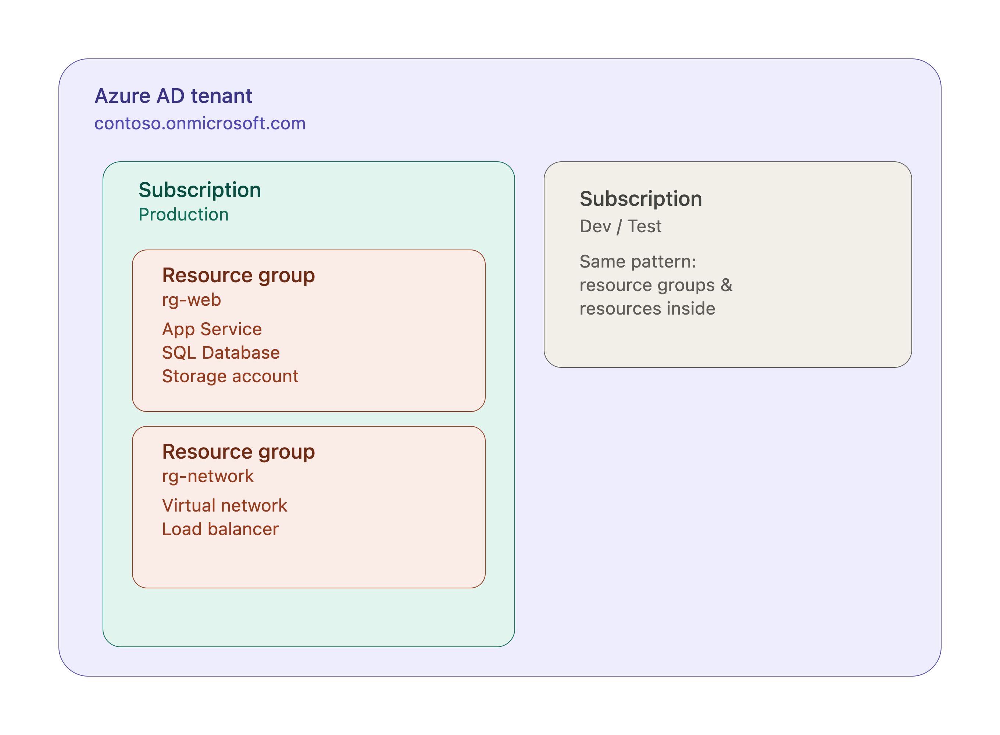

# Azure Fundamentals

An introduction to the core building blocks of Azure — before we touch Terraform, we need to understand what it's actually managing, and why we'll be reaching for Git and DevOps practices to manage it responsibly.

## Organisation

### Duration

2 hours (includes a 10 min break)

### Set-up

#### For Trainers

**For the slidee presentation** <br>
**Open** the [Slidee](https://github.com/mklilley/slidee) presentation:

- Run `npx slidee` from within the `curriculum` folder to see the available slide decks (those with extension `.slides.md`)
- Click on `See your presentations`
- Open `Weeks X Y > CDO > Azure Fundamentals`
- Hit `s` to open the presenter notes
- Resource to be kept open on a tab throughout lecture to refer to

**Check out** [FAQs](/FAQs/README.md) for help with using Slidee

#### For Students
- **Direct** students to the starter code for this module
  - [Student Facing Repo](https://github.com/LaFosseAcademy/cloud-devops-student-repos/tree/main)
- **Use**
  - **/azure-fundamentals/starter-code**
- **Make sure**
  - Students have an Azure account (a free trial or organisation-provided subscription is fine)
  - Students have the [Azure CLI](https://learn.microsoft.com/en-us/cli/azure/install-azure-cli) installed
  - No Terraform needed yet — that starts next session

## Learning objectives

- **Understand** the core Azure resource hierarchy: tenants, subscriptions, resource groups, and resources
- **Navigate** the Azure Portal and Azure CLI to view and create resources
- **Understand** identity and access basics — Azure AD, RBAC, and Service Principals
- **Recognise** the limitations of manually managing infrastructure through the Portal ("ClickOps")
- **Understand** how Infrastructure as Code, Git, and DevOps pipelines work together to address those limitations
- **Prepare** the groundwork needed to start hands-on Terraform in the next session

## Sequence

### What is Cloud Computing, briefly

We've spoken about the Cloud briefly in the Taster Session already but I want to go into what that means a little more. 

Cloud computing means renting:
- compute
- storage
- and networking for someone else's data centre

You pay for your usage instead of buying and running your own physical server. 

**ASK** <br>
Why do we think this is an option lots of companies take? <br>
**ANSWER**<br>
- There's no upfront costs
- There's also reduced costs for a Datacenter Technician. The person who would be responsible for installing the server racks, cabling, power.
- Also the ability to scale, if a company starts of with 1,000 users, it's easy to provision a small server from the cloud to accommodate those users. If a year later you have 100,000 users, equally it's simple to expand the resources taken from the cloud. 

There's lots of different models of accessing resources on the Cloud. 

I have an **iCloud** account. Based on the name we'd rightly say this is an example of Cloud computing. **iCloud** along with **Google Drive**, **One Drive** or **DropBox** all use the cloud but they only really offer is storage and networking.

The models which use all 3 which I want to focus on are:
- **SaaS**: Software as a Service
- **PaaS**: Platform as a Service
- **IaaS**: Infrastructure as a Service

Software as a Service is fairly straight forward, tools like: Gmail, Salesforce, Zoom. They're complete applications we can make use of. 

Platform as a Service is what it says on the tin. A platform for developers to build and run applications. Netlify, Heroku, Render. These types of services which require a bit more of a technical understanding and there's some ability to configure and manage the underlying servers. 

Finally we have Infrastructure as a Service and this takes us further towards the bare metal computers at the heart of all these models. 

Infrastructure as a service is essentially choosing what type of computer you want to access; how powerful, what storage and networking capabilities and it's your responsibility to manage to Operating System. 

Working with the Infrastructure as a Service model will give you the most flexibility, control over the underlying computer but as you can imagine it requires the most investment. 

This is what we're going to be focusing on over this Deep Dive though. 


**ASK** <br>
Which three providers dominate the cloud computing market? <br>
**ANSWER** <br>
AWS, Microsoft Azure, and Google Cloud Platform (GCP).

We're focusing on **Azure** for this part of the course, which is also what PDS use. It's deeply integrated with the Microsoft ecosystem many enterprises already run on.

You may have heard of **Active Directory**, it's a Microsoft product, essentially a digital phonebook. Lots of companies will give their employees Windows computers and use Active Directory to store their credentials. 

You'll be familiar with other Microsoft products like Office 365.

Windows Server is another operating system, specifically for servers.

All these different products are compatible with Azure.

*REFER TO RESOURCE 1 - SLIDEE* <br>

<br>
<br>

### The Azure Resource Hierarchy

Azure organises everything you own into a hierarchy. Understanding this now will save a lot of confusion once we start writing Terraform.

*REFER TO RESOURCE 2 - SLIDEE* <br>


From the top down:

* **Tenant**: your organisation's identity in **Azure AD** (Azure Active Directory). Almost always one tenant per organisation. Every user, group, and application registration lives inside a tenant.
* **Subscription**: a billing and access boundary *inside* a tenant. A single tenant can hold multiple subscriptions — commonly one per environment (`Dev`, `Test`, `Prod`) or one per business unit.
* **Resource Group**: this is a logical container inside a subscription that groups related resources sharing a lifecycle — imagine we have an application and we need a Virtual Machine, a Database and the ability to Monitor those resources. They'd all be attached to the same Resource Group.
* **Resource**: the actual thing being managed — a Virtual Machine, a Storage Account, a Virtual Network, and so on.

**ASK** <br>
Why might an organisation want several subscriptions, rather than just using more resource groups inside one big subscription? <br>
**ANSWER** <br>
Cleaner cost separation on the bill, harder access-control boundaries (someone with access to the `Dev` subscription doesn't automatically get anywhere near `Prod`), separate quotas/limits, and it limits the "blast radius" if something goes badly wrong in one environment.

Let's look at this live. In the [Azure Portal](https://portal.azure.com), search for **Subscriptions**.

I'm signed in as **emilesherrott_dev**, on the **Pay-As-You-Go** subscription, inside a tenant with **Tenant ID**: `9f4b1c2a-3d5e-4a6b-8c7d-1e2f3a4b5c6d`.


**NOTE FOR TRAINERS** <br>
This is a good moment to have students find and note down their own **Subscription ID** and **Tenant ID** — they'll need both in the next session when we authenticate Terraform. <br>
**END OF NOTE**

<br>
<br>

### Regions and Availability

We touched on this briefly if you've seen the resource provisioning sessions, but let's properly ground it here.

Azure runs datacentres in **regions** all over the world — `uksouth`, `northeurope`, `eastus`, and so on. Choosing a region affects **latency** (how close your users are to the servers) and **data residency** (which country your data legally sits in — often a compliance requirement, not just a preference).

**ASK** <br>
Beyond latency, why might a UK-based healthcare company specifically care which region their data lives in? <br>
**ANSWER** <br>
Regulatory requirements (e.g. UK GDPR, NHS data handling rules) can require patient data to stay within the UK, ruling out regions outside the country entirely regardless of cost or latency.

Some Azure regions come in **paired** sets for disaster recovery — for example, **UK South** is paired with **UK West**. Microsoft coordinates updates and prioritises recovery between paired regions, which is worth knowing about when designing for resilience, even though we won't configure it today.

Within a region, Azure also offers **Availability Zones** — physically separate datacentres within the same region, each with independent power and networking, so a failure in one zone doesn't take down the others.

<br>
<br>

### A Tour of the Azure Portal

Let's spend a few minutes just orienting ourselves in [portal.azure.com](https://portal.azure.com).

* The **search bar** at the top ("Search resources, services, and docs") is the fastest way to jump anywhere — much quicker than clicking through menus
* **Resource groups** — a filtered view of everything grouped by lifecycle
* **All resources** — every resource across every resource group you can see
* **Cost Management + Billing** — where the bill actually lives; worth a glance so students know it exists before their free trial credit vanishes unexpectedly

Let's create something by hand, the way we might if we were just getting started with Azure and hadn't heard of Terraform yet.

* Search **Resource groups** > **Create**
* **Subscription**: Pay-As-You-Go
* **Resource group name**: `rg-fundamentals-demo`
* **Region**: `UK South`
* **Review + create** > **Create**


That took maybe 30 seconds. Quick, easy, and — as we'll get to shortly — exactly the kind of thing that becomes a real problem at scale.

<br>
<br>

### The Azure CLI

Everything we just did in the browser, we can also do from the terminal using the **Azure CLI**.

* `az login` — opens a browser to authenticate, same as before
* `az account show` — see which subscription we're currently working in
* `az account list -o table` — list every subscription we have access to
* `az account set --subscription "Pay-As-You-Go"` — switch which subscription commands run against

Let's list the resource group we just created:

* `az group list -o table`

And create another one, this time from the CLI:

* `az group create --name rg-fundamentals-cli --location uksouth`

**ASK** <br>
What's the practical difference between creating that resource group by clicking through the Portal wizard, versus running that one CLI command? <br>
**ANSWER** <br>
The CLI command can be saved in a file, re-run exactly the same way tomorrow, shared with a teammate, or dropped straight into a script — the Portal click can't easily be replayed or handed to someone else in a reliable form.

We can inspect what's inside a resource group too:

* `az resource list --resource-group rg-fundamentals-demo -o table`

**NOTE FOR TRAINERS** <br>
Don't dwell too long on CLI syntax here — this isn't a CLI deep-dive, it's a stepping stone to show students that everything clickable in the Portal has a scriptable equivalent. That idea is the whole bridge into Infrastructure as Code later in this session. <br>
**END OF NOTE**

<br>
<br>

### Identity and Access: Azure AD, RBAC and Service Principals

We need a foundational understanding of identity before we can talk sensibly about automation.

**Azure AD** is Azure's identity provider — it's where **users**, **groups**, and **application identities** live, and it sits *above* subscriptions in the hierarchy we drew earlier (one Azure AD tenant can be linked to many subscriptions).

**ASK** <br>
So far, who or what has been authenticating to Azure in everything we've done today? <br>
**ANSWER** <br>
A human — `emilesherrott_dev`, via `az login` or the Portal sign-in.

That's fine for a person clicking around, but it doesn't work well for automation. This is where **Service Principals** come in — an identity in Azure AD that represents an **application or automated process**, rather than a human.

* `az ad sp create-for-rbac --name "example-automation-identity" --role="Reader" --scopes="/subscriptions/<your-subscription-id>"`

Running this returns an `appId` (Client ID), `password` (Client Secret), and `tenant` — credentials that a script, pipeline, or tool can authenticate with, entirely independent of any human's login.

**ASK** <br>
Why would we want automation to use its own separate identity, rather than just running everything under a person's own Azure login? <br>
**ANSWER** <br>
It doesn't break when that person is on holiday or leaves the company; it can be scoped down to only the permissions it actually needs; it can be rotated or revoked on its own without touching a human's account; and it works headlessly, without anyone needing to be logged in at all — essential for anything running in a pipeline.

Access itself is controlled through **RBAC** — **Role-Based Access Control**. A **role** (like `Owner`, `Contributor`, or `Reader`) is assigned to an identity (a user *or* a Service Principal) **at a scope** — a Management Group, a Subscription, a Resource Group, or an individual Resource.

*REFER TO RESOURCE 3 - SLIDEE* <br>

**ASK** <br>
If our automation only ever needs to manage resources inside one resource group, should we grant its Service Principal `Contributor` on the whole subscription? <br>
**ANSWER** <br>
No — scope the role assignment down to just that resource group. This is the principle of **least privilege**: grant only the access actually needed, at the narrowest scope that still works.

**NOTE FOR TRAINERS** <br>
This is deliberately a preview, not a deep-dive — students will create and use a real Service Principal hands-on in the next session when authenticating Terraform. The goal here is just that the concept isn't a surprise when it shows up. <br>
**END OF NOTE**

<br>
<br>

### The Problem with "ClickOps"

Let's go back to that resource group we created by hand in the Portal a few minutes ago, and really interrogate it.

**ASK** <br>
If I asked you right now to recreate `rg-fundamentals-demo` — with identical settings — in a brand new subscription, how would you do it? <br>
**ANSWER** <br>
Probably from memory, or by clicking back through and reading off the settings we chose — slowly, and with a real chance of getting something slightly wrong.

This pattern of manually clicking through a cloud console to build infrastructure is sometimes called **"ClickOps"**, usually not as a compliment. Some of the problems with it:

* **Not repeatable** — there's no reliable way to do exactly the same thing twice
* **No audit trail** — the Portal shows *that* a resource was created, and by whom, but not *why*, or what the reasoning was
* **Environment drift** — Dev, Test, and Prod slowly diverge because someone made a "quick fix" by hand in one of them and not the others
* **No review process** — nothing stops one person from making a risky change directly, with nobody else checking it first
* **Tribal knowledge** — the exact steps to build something correctly often only exist in one engineer's head

**ASK** <br>
If we needed to rebuild our entire development environment from scratch in a new subscription for disaster recovery testing, and everything had been built by hand through the Portal, how confident would we be that the rebuild matched the original exactly? <br>
**ANSWER** <br>
Not very — and that's exactly the situation that causes real incidents.

None of this means the Portal is bad — it's genuinely great for exploring, learning what a service looks like, and one-off investigation (which is exactly what we've used it for today). The problem is relying on it as the *primary* way real infrastructure gets built and maintained.

<br>
<br>

### From ClickOps to Infrastructure as Code

This is exactly the gap **Infrastructure as Code (IaC)** tools like **Terraform** are built to close — which is where we're headed in the very next session.

The core idea: instead of clicking through a wizard, we write our **desired infrastructure state** in text files. A tool then compares that desired state against what actually exists, and makes only the changes needed to reconcile the two.

*REFER TO RESOURCE 4 - SLIDEE* <br>

That gets us:
* **Repeatability** — run the same files against a new subscription, get the same infrastructure
* **Review** — a proposed change can be read and understood by someone else *before* it happens
* **History** — every change is a discrete, inspectable diff, not an invisible click
* **Self-documentation** — the `.tf` files themselves describe exactly what exists and why, no tribal knowledge required

We won't touch Terraform syntax today — that's next session — but everything from here on is about *why* we'll bother with it, not just *how*.

<br>
<br>

### Where Git Fits In

Here's the detail that ties Infrastructure as Code back to everything you already know about software development: **Terraform configuration files are just text**. And anything that's just text belongs in **version control**.

**ASK** <br>
What do we already use Git for, in a normal application codebase? <br>
**ANSWER** <br>
Tracking history, working on features in branches without disturbing everyone else, reviewing changes via Pull Requests before they're merged, and being able to revert if something breaks.

Every one of those benefits applies directly to infrastructure code too. A typical workflow looks like:

1. An engineer creates a branch and edits `.tf` files to describe the infrastructure change they want
2. They open a **Pull Request**
3. A teammate reviews the proposed change — often alongside the output of `terraform plan`, which shows exactly what would be added, changed, or destroyed
4. Once approved, the PR is merged
5. Only *then* does the change actually get applied to real infrastructure

**ASK** <br>
What extra confidence does step 3 — a human reviewing the `terraform plan` output in a Pull Request — give us, compared to an engineer just running `terraform apply` directly from their own laptop? <br>
**ANSWER** <br>
A second set of eyes catches mistakes before they hit real infrastructure; there's a permanent record of who approved the change and when; and it becomes much harder for one person's momentary slip — a wrong region, an oversized VM, a mistakenly deleted resource — to reach production unnoticed.

<br>
<br>

### DevOps Fundamentals: Tying It All Together

We've mentioned the DevOps mantra **"you build it, you run it"** before — the idea that the people who write and design a system are also accountable for running and fixing it in production, rather than throwing it over a wall to a separate operations team.

Everything we've covered today feeds directly into that. Here's the fuller picture a real DevOps pipeline usually looks like:

*REFER TO RESOURCE 5 - SLIDEE* <br>

```
engineer pushes .tf changes
        |
        v
Pull Request opened  ---->  terraform plan runs automatically, posted for review
        |
        v
teammate reviews and approves
        |
        v
PR merged to main
        |
        v
pipeline runs terraform apply automatically
        |
        v
Azure resources updated
```

**ASK** <br>
Why run `terraform apply` from an automated pipeline, using a Service Principal, rather than from an individual engineer's own laptop with their own login? <br>
**ANSWER** <br>
The pipeline runs the exact same Terraform version and environment every time — no "it worked on my machine"; credentials live scoped to the pipeline rather than sitting on someone's laptop; and every single `apply` is automatically logged, with a clear link back to the PR and commit that caused it.

This is the same Service Principal concept from earlier in the session — the pipeline authenticates as an automated identity, not a person, using exactly the `ARM_CLIENT_ID` / `ARM_CLIENT_SECRET` / `ARM_SUBSCRIPTION_ID` / `ARM_TENANT_ID` pattern we'll set up hands-on next session.

<br>
<br>

### What's Next

Next session, we'll get hands-on: creating a real Service Principal, configuring Terraform's environment variables, and writing our first `.tf` files against the resource hierarchy we've explored today. Everything from today — subscriptions, resource groups, regions, RBAC, and *why* we bother with Git and pipelines around it — is the foundation the rest of the course builds on.

<br>
<br>

### Exercise

Students, working individually or in pairs:
1. In the Azure Portal, find and note down your own **Subscription ID** and **Tenant ID**
2. Create a resource group by hand in the Portal, then create a second one using `az group create` — compare how each felt
3. In small groups, discuss: if your team's infrastructure was entirely built via ClickOps today, what's the single biggest risk you'd worry about? Be ready to share back
4. (Stretch) Look up what `az role assignment list --scope /subscriptions/<your-subscription-id>` returns for your own account, and see if you can identify what role you currently hold and at what scope

<br>
<br>

### Conclusion

- **Inform** students this marks the end of the Azure Fundamentals session
- **Tell** students that the next session moves straight into hands-on Terraform, starting with creating and authenticating a Service Principal
- **Direct** students to the exercises and to Microsoft's own [Azure Fundamentals documentation](https://learn.microsoft.com/en-us/training/paths/azure-fundamentals/) for further reading

---

[Back](./README.md)

---

