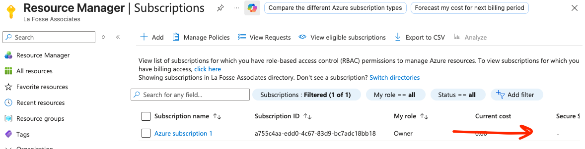
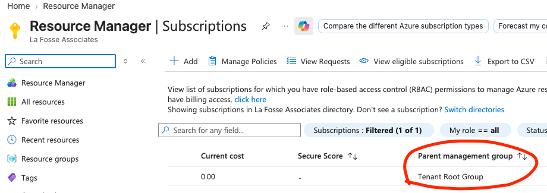

# Session 1 — Azure Fundamentals — Trainer Script

An introduction to DevOps as a way of working, and to the core building blocks of Azure that everything else this course covers will sit on top of. This is written as a script — read it out, adapt where it feels natural, but the intent is that you could deliver this cold from the page.

---

## 📦 STARTER CODE — put this in the repo before training

Everything in this section goes into **`/azure-fundamentals/starter-code`** in the student repo before Day 1.

**Deliberately just three files, and none of them are scripts.** Today is day one — students haven't done any bash yet, and the whole point of the session is understanding the *Portal*, the *concepts* and the *raw CLI commands*. Wrapping `az account show` in a script would hide the very thing we're trying to teach.

The commands themselves get typed live (or pasted from Slack). What the repo provides is a **place to record their own values** and a **reference sheet**, both of which they'll use for the rest of the course.

<br>

**`README.md`**
```markdown
# Azure Fundamentals — Starter Code

Two files matter here:

- **my-azure-details.md** — fill this in during the session.
  You will need these values in Sessions 5, 6, 7 and 8. Keep it.

- **commands.md** — every Azure CLI command we use today,
  with a one-line explanation of each. Use it as a reference.

There are no scripts in this folder on purpose. Today we run
commands directly so you can see exactly what each one does.
```

<br>

**`my-azure-details.md`** *(students fill this in — they will need it in every later session)*
```markdown
# My Azure Details

Filled in during Session 1. **Keep this file** — Sessions 5, 6, 7 and 8 all need these values.

| What | Value |
|---|---|
| Subscription name | |
| Subscription ID | |
| Tenant ID | |
| Tenant default domain | e.g. `something.onmicrosoft.com` |
| Any custom domain | e.g. `lafosse.com` |
| My user principal name (UPN) | e.g. `firstname.lastname@lafosse.com` |
| My unique storage prefix | e.g. `stjbloggs` |

## Service Principal (created in the Identity section)

| What | Value |
|---|---|
| Display name | |
| appId (Client ID) | |
| password (Client Secret) | **keep secure — never commit to Git** |
| tenant | |
```

<br>

**`commands.md`**
```markdown
# Azure CLI — Session 1 Reference

Everything we run today, with what it does.

## Getting started

    az --version          Check the CLI is installed
    az login              Sign in (opens a browser)
    az account show       Show the subscription you're currently working in

## Reading the output of `az account show`

It returns JSON. The fields that matter:

    id                    Your SUBSCRIPTION ID  <- write this down
    name                  The subscription's display name
    tenantId              Your TENANT ID        <- write this down
    tenantDefaultDomain   Your TENANT DOMAIN    <- write this down
    user.name             Who you're signed in as
    state                 Is the subscription active

## Pulling out a single value

    az account show --query id -o tsv

    --query   picks one field out of the JSON
    -o tsv    prints the bare value, with no quotes or brackets
    -o table  prints a readable table instead of JSON

## Resource groups

    az group list -o table                              List them
    az group create --name <name> --location uksouth    Create one
    az group delete --name <name> --yes                 Delete one (and everything in it)

## Resources

    az resource list -o table                           Everything you own
    az resource list --resource-group <name> -o table    Everything in one group

## Storage accounts

    az storage account create \
      --name <globally-unique-name> \
      --resource-group <rg-name> \
      --location uksouth \
      --sku Standard_LRS

Name rules: lowercase letters and numbers only, 3-24 characters,
and unique across the whole of Azure.

## Identity

    az ad signed-in-user show                Your own user object
    az ad sp list --show-mine -o table       Service Principals you created

    az ad sp create-for-rbac \
      --name "example-automation-identity" \
      --role "Reader" \
      --scopes "/subscriptions/<your-subscription-id>"

    az role assignment list --assignee <upn-or-appId> -o table
```

<br>

---

## 💬 SLACK SNIPPETS — queue these before you start

Have these in a draft message. **Post reactively** at the point in the session where they're needed, so students copy rather than mistype.

| # | When | What to post |
|---|---|---|
| 1 | 10:30, account setup | Install + `az login` + `az account show` |
| 2 | 11:15, hierarchy | The four values to record, as `--query` one-liners |
| 3 | 12:15, portal tour | Storage account naming rules |
| 4 | 12:40, portal tour | `az group create` / `az storage account create` |
| 5 | 15:15, identity | `az ad sp create-for-rbac` |
| 6 | 16:30, cleanup | The delete commands |

Each is marked **💬 SLACK** in the body below.

---

## Organisation

### Audience

People **new to both DevOps and Cloud**, but **not new to software**. Assume they are comfortable with:

- **Node and Express**, REST APIs, MVC structure
- **Git and GitHub** — branches, commits, pull requests
- **SQL** and relational databases
- **Docker** — images, containers, registries
- **Frontend development** and **testing** (unit and integration)

That's a genuinely useful starting point, and this script leans on it: wherever a cloud concept has a close analogue in something they already know, the analogy is drawn explicitly. What they have *not* done is run anything in a cloud, think about infrastructure, or work with identity and access — so those are built from scratch.

**NOTE FOR TRAINERS** <br>
Do not pitch this as a beginners' session. This room can read a config file, understand a JSON response, and knows what an API is — treating them as novices will lose them in the first hour. The gap is not technical ability, it's **operational context**: they've built applications, they've never had to run one. Frame everything as "here's the bit of the job you haven't seen yet." <br>
**END OF NOTE**

<br>

### ⚠️ Your screen vs their screen — read this before demoing

You are demoing from an **established corporate tenant**. They are on **brand-new personal free-trial tenants**. Several things on screen will not match, and if you don't call it out, people spend the afternoon quietly assuming they've done something wrong.

Here is the actual difference, using real values from a La Fosse tenant:

| What | **On your screen (corporate tenant)** | **On their screen (new free trial)** |
|---|---|---|
| Tenant display name | `La Fosse Associates` | Usually their own name, or blank |
| Tenant **default** domain | `lafosse.com` — a *verified custom domain* | `jbloggsoutlook.onmicrosoft.com` — auto-generated, no custom domain |
| Your UPN (`az ad signed-in-user show`) | `emile.sherrott@lafosse.com` | `jbloggs@jbloggsoutlook.onmicrosoft.com`, **or** an external-style UPN (see below) |
| Subscription name | `Azure subscription 1` | `Azure subscription 1` or `Free Trial` |
| Existing resource groups | Possibly several, from other work | **None.** An empty list is correct |
| Your directory role | Likely a **member**, possibly restricted | **Global Administrator** — they own the whole tenant |

**The counter-intuitive one, worth saying out loud:** on their own free-trial tenant, **students often have _more_ permission than you do.** They are the Global Administrator of a directory they created. You are one user inside a company directory managed by someone else. So if a command fails for you but works for them, that's the reason — and it's a genuinely useful illustration of RBAC before we've even taught it.

**The external-UPN wrinkle.** If a student signed up for Azure using an existing Gmail/Outlook address rather than creating a fresh Microsoft account, their UPN comes back looking like:

```
jbloggs_gmail.com#EXT#@jbloggsoutlook.onmicrosoft.com
```

That `#EXT#` means "external identity invited into this directory". It's completely normal, it works fine, and it will look alarming. Tell them before they run the command, not after.

**Why this matters beyond today.** In Session 5 they'll write Terraform that creates Azure AD users, and a `user_principal_name` **must sit on a domain the tenant actually owns**. Your demo will use `@lafosse.com`; theirs must use their own `.onmicrosoft.com`. If they copy your value verbatim, Terraform fails with `Property userPrincipalName is invalid`. That's the whole reason we record the tenant domain today.

**NOTE FOR TRAINERS — recommended demo hygiene** <br>
Two options, both fine, pick one and be consistent: <br>
**(a) Demo from your corporate tenant** and narrate the differences at each step, using the table above. More realistic, shows a real organisation's directory. <br>
**(b) Create a throwaway personal free-trial tenant** and demo from that, so your screen matches theirs exactly. Less realistic, far fewer questions. <br>
Whichever you choose, **do not** silently switch between them mid-session — that's where confusion compounds. <br>
**END OF NOTE**

### Duration & schedule

Full day, **09:00–17:00**, with a one-hour lunch and three 15-minute breaks.

**Hands-on time today: ~2 hours 25 minutes** across seven activities, each with a solution in this document.

| Time | Section | Activity time |
|---|---|---|
| 09:00–09:15 | Welcome & introductions | |
| 09:15–09:45 | What DevOps looks like to an engineer | |
| 09:45–10:15 | Cloud computing & service models | |
| **10:15–10:30** | **Break** | |
| 10:30–11:15 | Setting up your Azure account | **25 min** |
| 11:15–12:00 | The Azure resource hierarchy | **25 min** |
| **12:00–12:15** | **Break** | |
| 12:15–13:00 | Portal tour, resource groups & your first resources | **35 min** |
| **13:00–14:00** | **Lunch** | |
| 14:00–14:30 | Regions and availability | **15 min** |
| 14:30–15:00 | Networking basics | **15 min** |
| **15:00–15:15** | **Break** | |
| 15:15–16:00 | Identity & access: Azure AD, RBAC, Service Principals | **25 min** |
| 16:00–16:30 | The problem with ClickOps | **10 min** |
| 16:30–17:00 | Roadmap, wrap-up & Q&A | **10 min** |

### Set-up

#### For Trainers

**For the slidee presentation** <br>
**Open** the [Slidee](https://github.com/mklilley/slidee) presentation:

- Run `npx slidee` from within the `curriculum` folder to see the available slide decks (those with extension `.slides.md`)
- Click on `See your presentations`
- Open `Cloud Azure Fundamentals`
- Resource to be kept open on a tab throughout lecture to refer to

#### For Students
- **Direct** students to the starter code for this module
  - [Student Facing Repo](https://github.com/LaFosseAcademy/cloud-devops-student-repos/tree/main)
- **Use**
  - **/azure-fundamentals/starter-code**
- **Make sure**
  - Students bring a laptop and, ideally, a payment card for Azure free-trial verification (not charged unless they explicitly upgrade)
  - Students have the [Azure CLI](https://learn.microsoft.com/en-us/cli/azure/install-azure-cli) installed, or can install it during the account setup section
  - Students have **cloned the starter repo** before the session
  - No Terraform, Jenkins, or Kubernetes needed today — those are separate sessions, previewed at the end

## Learning objectives

- **Understand** DevOps as a mindset and set of daily habits, not just a job title or a toolchain
- **Understand** the core Azure resource hierarchy: tenants, subscriptions, resource groups, and resources
- **Set up** a working Azure account and navigate both the Portal and the CLI
- **Record** their own subscription ID, tenant ID and tenant domain, for use in every later session
- **Understand** the basics of Azure networking and identity/access (RBAC, Service Principals)
- **Explain** why automation needs its own identity, and how that differs from a human signing in
- **Recognise** the limitations of manually managing infrastructure through the Portal ("ClickOps")
- **Leave** with a clear picture of how today connects to the sessions that follow

<br>

## Sequence

### 09:00–09:15 — Welcome & Introductions

Morning everyone, welcome. Today's the first of a run of sessions that'll take you from the basics through to actually being able to build, automate and ship infrastructure the way a real DevOps engineering team does it.

Quick framing, because it matters for how I pitch this. **You are not beginners.** You can build a REST API in Express, structure it properly with MVC, put it behind a database, write tests for it, containerise it with Docker and manage the whole thing in Git. That's a lot.

What you haven't done yet, from your project weeks is **run** any of it. Someone else has always handled where it lives, how it gets there, who's allowed to touch it, and what happens at 3am when it falls over. That's the gap this course fills, and it's a job, not an afterthought.

Today is about two things. First: what actually *is* DevOps, and what does it change about how you work. Second: getting properly comfortable in Azure, because every future session assumes you know your way around it.

There's a repo I want you to clone down now, it's going to have starter code and some resources for us to use throughout the Deep Dive. [Student Facing Repo](https://github.com/LaFosseAcademy/parliament_devops_student_facing/tree/main)

You'll see two files:
- `01-commands.md` - This is a guide for you go have, use throughout the training
- `01-my-azure-details.md` - This is for you to populate throughout the course of the day. Other sections will need some information, id's etc.. which we'll find out today so make a note of them as we go through and it'll make our lives easier.                                                                     
Full day. Lunch at 1 for an hour, and a 15-minute break roughly every ninety minutes — flag it if you need one sooner.

**Before anything else — two commands**, so you know where you're at.

*(Run from anywhere)*
```bash
az --version
az account show
```

If the first errors, the CLI isn't installed. If the second errors, you're not signed in. Either way, we'll get up and running in a short while.

<br>
<br>

### 09:15–09:45 — What DevOps Looks Like to an Engineer

Let's start with DevOps itself, before we touch a single Azure resource — because the tools we'll spend the rest of today and the coming sessions on only make sense once you understand the problem they exist to solve.

Historically, software teams were split into two camps. **'Dev'** — the people who wrote application code — and **'Ops'** — the people who kept servers running, deployed changes, and got paged at 3am when something broke. These two teams had, in practice, opposite incentives. Dev were rewarded for shipping features fast. Ops were rewarded for stability, which usually meant resisting change, because change is what breaks things. That tension is a big part of why deployments used to be huge, dreaded, quarterly events — and why they went wrong so often when they did happen.

DevOps grew out of that dysfunction. There's a mantra that captures the core idea, and we'll come back to it more than once today:

> **'You build it, you run it.'**

The same people — or at least the same team — who write a piece of software are also accountable for deploying it, monitoring it, and fixing it at 3am if it breaks.

**ASK** <br>
What do we think changes about how someone writes code, if they know *they* are the one who'll get the phone call if it breaks in production? <br>
**ANSWER** <br>
They write more defensively. They add their own logging and monitoring instead of assuming someone else will. They test more thoroughly. They design for failure. Because the consequence of a bad decision now lands directly on them, not on a separate team down the corridor.

That one incentive shift explains a surprising amount of DevOps culture and tooling.

One common way people summarise the pillars of DevOps is the acronym **CALMS**:

- `SLIDE ACROSS`

- **Culture** — breaking down the wall between Dev and Ops. Shared responsibility instead of finger-pointing when something breaks
- **Automation** — anything a human does repeatedly and manually is a future source of mistakes. If you're doing it by hand every week, it should probably be a script
- **Lean** — small, frequent changes are safer than big, infrequent ones. A ten-line change is easy to review and easy to roll back; a thousand-line change that's sat in a branch for three months is terrifying
- **Measurement** — you can't improve what you don't measure. Deployment frequency, time to recover from an incident, error rates
- **Sharing** — knowledge shouldn't live in one person's head. Document it, pair on it, review it

**ASK** <br>
Which of those five do you think is hardest for an established, traditional company to actually change? <br>
**ANSWER** <br>
Usually Culture. Buying a new tool or installing a pipeline is comparatively easy. Changing how teams are structured, how success is measured, and how blame is (or isn't) handled after an incident is a much slower, harder organisational shift — and it's the one that makes all the others stick.

So practically — what does this look like in an engineer's daily habits? Five things we'll keep returning to:

- `SLIDE ACROSS`

1. **Everything as code, everything in version control.** You already do this for application code. The shift is that **infrastructure, pipeline configuration and even documentation** get the same treatment. If it's not in Git, it effectively doesn't exist to the team — it can't be reviewed, reverted or reliably reproduced.
2. **Small, frequent changes over big, risky ones.**
3. **Automate the boring, repeatable stuff.** If you find yourself doing the same five manual steps every Friday, that's a script — and eventually a pipeline — waiting to be written.
4. **Treat failure as information, not blame.** Things will break. The habit isn't 'never fail', it's 'fail safely, recover quickly, and write up what happened' — a blameless postmortem.
5. **Monitor and measure rather than guess.** A good engineer can tell you how their system is performing *right now*, not just once it's already on fire.

**ASK** <br>
Point one should feel familiar. You already review application code through pull requests. What would it mean to review a **server** through a pull request? <br>
**ANSWER** <br>
It means the server's definition is a text file — how much memory, which ports are open, which network it sits on — and changing it means opening a PR that a colleague reads and approves before anything happens to the real thing. That's Terraform, in three sessions' time. The mental model you already have for code review transfers wholesale; only the subject matter changes.

**ASK** <br>
Can anyone think of a task — in any job or life, not just tech — that someone would do the exact same way, by hand, every single week? <br>
**ANSWER** <br>
- We create Zoom channels for every cohort which runs — could we save time automating it?
- I've written a script to clone all your repos once you've sat a debug assignment; it saves me doing it manually

This mindset is what the rest of the course builds hands-on skill around:

- **Linux & automation** — working comfortably on a server and a command line, and scripting the boring stuff away
- **Jenkins & pipelines** — how 'small, frequent changes' actually get built, tested and deployed automatically, rather than by someone clicking a deploy button
- **Terraform & Infrastructure as Code** — 'everything as code' applied to the infrastructure we're about to explore by hand today
- **Kubernetes** — running and scaling applications reliably once they're built and deployed
- **Integrating it all together** — one real pipeline: a code change flowing through to running infrastructure, automatically, safely and reviewably

Everything today is building the vocabulary and the map for those sessions. By the end of today, when we say 'resource group' or 'Service Principal' in the Terraform session, it shouldn't be the first time you've heard it.

<br>
<br>

### 09:45–10:15 — Cloud Computing & Service Models

So — cloud computing. In one sentence: renting compute, storage and networking in someone else's data centre, paying for what you use, instead of buying and running your own physical servers.

**ASK** <br>
Why do we think so many companies choose this over running their own hardware? <br>
**ANSWER** <br>
- No large upfront cost for buying servers
- No need to employ people to physically rack, cable and power hardware
- Easy to scale — 1,000 users to 100,000 is straightforward to provision for, and the reverse is true too when you need to scale back down

There are several models for accessing cloud resources. Everyone here has probably used iCloud, Google Drive or Dropbox — cloud services, but really only storage and networking. The three models you should actually know:

- `SLIDE ACROSS`

- **SaaS** — Software as a Service
- **PaaS** — Platform as a Service
- **IaaS** — Infrastructure as a Service

**Software as a Service** is the simplest — Gmail, Salesforce, Zoom. Complete, finished applications you just use.

**Platform as a Service** is a platform for developers to build and run applications on — Netlify, Heroku, Render. More technical understanding needed, some ability to configure the environment, but the provider still manages the servers.

**Infrastructure as a Service** takes us closest to bare metal. You choose what kind of computer you want — how powerful, what storage, what networking — and it's your job to manage the operating system upwards. Full control, full responsibility.

**ASK** <br>
Most of you have deployed something to Netlify, Heroku or Render. Which model is that, and what did you *not* have to think about? <br>
**ANSWER** <br>
PaaS. You pushed code and it ran — you never chose an operating system, never patched anything, never configured a web server, never thought about how many machines it was on. That's the trade: enormous convenience, in exchange for someone else making all the decisions. This course is largely about what those decisions actually are, and what you gain by making them yourself.

Quick way to remember it:

- **IaaS** → *'Give me a computer.'* (Amazon EC2, Azure VM, Google Compute Engine — our focus for this Deep Dive)
- **PaaS** → *'Give me somewhere to run my code.'* (App Engine, Heroku, Azure App Service)
- **SaaS** → *'Give me the finished software.'* (Slack, Spotify, Zoom, Microsoft 365)

Let's play a quick game — I'll name something, you tell me IaaS, PaaS, SaaS, or None.

| Example | Answer | Why |
|---|---|---|
| Amazon EC2 | IaaS | You control the OS, software and configuration; Amazon manages the physical infrastructure |
| Slack | SaaS | You use a finished application through a UI; you manage nothing underneath |
| Google App Engine | PaaS | You deploy your app; Google manages servers, OS and runtime |
| Toyota | None | Manufactures cars, not cloud services |
| Azure Virtual Machines | IaaS | You control the VM, OS and applications; Microsoft manages the physical infrastructure |
| Microsoft 365 | SaaS | Finished applications; Microsoft manages everything beneath them |
| Heroku | PaaS | You provide the code; Heroku handles infrastructure and runtime |
| McDonald's | None | Food and restaurant services |
| Google Compute Engine | IaaS | You control the VM; Google manages the hardware |
| Spotify | SaaS | A finished, consumed application |
| Azure App Service | PaaS | Deploy your app without managing servers or OS |
| Nike | None | Sells physical products |
| Dropbox | SaaS | A finished cloud application |
| DigitalOcean Droplets | IaaS | You get a virtual server and manage the OS |
| AWS Elastic Beanstalk | PaaS | You deploy; AWS manages most infrastructure |
| Coca-Cola | None | Produces beverages |
| Zoom | SaaS | Finished video-conferencing software |
| Salesforce Platform | PaaS | Build on a managed platform |
| Google Workspace | SaaS | Finished applications, consumed through a browser |
| Disney | None | Entertainment, media and theme parks |

And out of curiosity — what if instead of Disney I'd said Disney Plus? That one's genuinely fuzzy — reasonably SaaS, or just a cloud-based streaming/subscription service. Not everything falls neatly into one bucket, and that's fine.

**ASK** <br>
Where does **Docker Hub** sit in that model? <br>
**ANSWER** <br>
A nice awkward one. It's SaaS from your point of view — a finished service you consume via `docker push` and `docker pull`. But it's specifically *developer infrastructure*, which is why people sometimes carve out extra categories. The lesson is that the three-model split is a useful map, not a law, and arguing about edge cases is less useful than knowing what you personally are responsible for.

**ASK** <br>
Which three providers dominate the cloud computing market? <br>
**ANSWER** <br>
AWS, Microsoft Azure, and Google Cloud Platform (GCP).

We're focusing on **Azure** because it's what PDS use, and because it's deeply integrated with the Microsoft ecosystem so many enterprises already run on — **Active Directory** (essentially a company's digital phonebook of user credentials), **Office 365**, and **Windows Server**. All of it plugs directly into Azure.

<br>
<br>

*(Take a 15 minute break here.)*

<br>
<br>

### 10:30–11:15 — Setting Up Your Azure Account
*(Activity: 25 min)*

Right — let's get you into Azure properly. Everything from here assumes you have your own account to click around in.

Azure offers a **free trial**: around £150–£200 of credit valid for 30 days, plus services that stay free for 12 months, plus a smaller "always free" set. You'll need a Microsoft account and a payment card. **The card is for identity verification only** — you won't be charged unless you explicitly upgrade, and we'll cover watching your spend later today.

If you already have an organisation-provided subscription, use that instead.

**⚠️ Expect your screen to differ from mine.** I'm signed in to the La Fosse corporate tenant; you'll be on a brand-new personal one. Specifically:
- My tenant is called **La Fosse Associates**; yours will probably show your own name
- My domain is **`lafosse.com`**; yours will be something like **`jbloggsoutlook.onmicrosoft.com`**
- I have existing resource groups; **you should have none — an empty list is correct**
- You are the **Global Administrator** of your tenant. I'm not of mine. You genuinely have more power here than I do

**HANDS ON (25 min)** <br>

Part A — sign up.
- Go to `azure.microsoft.com/free`
- Sign in with (or create) a Microsoft account
- Follow the identity and card verification steps
- You'll land in the Azure Portal at `portal.azure.com`

Part B — orient yourself in the Portal.
- The **search bar** at the top ("Search resources, services, and docs") is the fastest way to jump anywhere — much quicker than the menus
- **Resource groups** — everything grouped by lifecycle
- **All resources** — every resource you can see
- **Cost Management + Billing** — where the bill lives. Look now, before your credit vanishes later
- Search **Subscriptions** and find yours — note the **Subscription ID**

Part C — install the CLI and sign in.
- **Windows**: https://community.chocolatey.org/packages/azure-cli
- **Mac**: https://formulae.brew.sh/formula/azure-cli
- Confirm with `az --version`
- Run `az login` — opens a browser, same account as the Portal
- Run `az account show`

Part D — record your details.
- Run `az account show` and read the JSON it returns
- Copy the values into `my-azure-details.md` — **you need these in four later sessions**
**END OF NOTE**

**💬 SLACK — snippet 1**, post at the start of this activity:
```bash
# Install (Mac)
brew install azure-cli

# Install (Windows)
choco install azure-cli

# Then, everyone:
az --version
az login
az account show
```

**Solution**

*(Run from anywhere)*
```bash
az --version
az login
az account show
```

#### Reading `az account show` — do this bit together, on screen

The response is JSON, which everyone in this room reads fluently. Put it up and walk the fields.

**This is my output. Yours will differ in every value:**

```json
{
  "environmentName": "AzureCloud",
  "homeTenantId": "bff07bc0-bc49-46ca-9f9f-6ce7c451f2a7",
  "id": "a755c4aa-edd0-4c67-83d9-bc7adc18bb18",
  "isDefault": true,
  "managedByTenants": [],
  "name": "Azure subscription 1",
  "state": "Enabled",
  "tenantDefaultDomain": "lafosse.com",
  "tenantDisplayName": "La Fosse Associates",
  "tenantId": "bff07bc0-bc49-46ca-9f9f-6ce7c451f2a7",
  "user": {
    "name": "emile.sherrott@lafosse.com",
    "type": "user"
  }
}
```

Field by field:

| Field | What it is | Record it? |
|---|---|---|
| `id` | Your **Subscription ID**. The single most-used value in this course | **Yes** |
| `name` | The subscription's display name — `Azure subscription 1` by default | Yes |
| `tenantId` | Your **Tenant ID** — the directory this subscription belongs to | **Yes** |
| `tenantDefaultDomain` | The **domain** your tenant owns. Mine is a verified custom domain; yours will end `.onmicrosoft.com` | **Yes** |
| `tenantDisplayName` | The organisation's name | No |
| `user.name` | Who you're currently signed in as | Yes |
| `user.type` | `user` for a human, `servicePrincipal` for automation — **worth noticing now**, it matters this afternoon | No |
| `state` | Is the subscription active | No |
| `isDefault` | Whether this is the subscription commands run against, if you have several | No |
| `environmentName` | Which Azure cloud — sovereign clouds exist for government use | No |

**On a new free-trial tenant, expect this shape instead:**

```json
{
  "id": "<a different GUID>",
  "name": "Azure subscription 1",
  "tenantDefaultDomain": "jbloggsoutlook.onmicrosoft.com",
  "tenantDisplayName": "Default Directory",
  "tenantId": "<a different GUID>",
  "user": {
    "name": "jbloggs@jbloggsoutlook.onmicrosoft.com",
    "type": "user"
  }
}
```

Two differences to point out explicitly: **`tenantDefaultDomain` ends `.onmicrosoft.com`** because there's no custom domain, and **`tenantDisplayName`** is usually `Default Directory` rather than a company name.

#### Pulling out one value at a time

Reading a whole JSON blob to find one field is fine by eye, useless in a script. So:

```bash
az account show --query id -o tsv
```

- `--query id` picks a single field out of the JSON, in this case the `id`. It's **JMESPath** — think of it as a query language for JSON, conceptually like a selector
- `-o tsv` prints the bare value with no quotes or braces

You should compare the two side by side on screen — `az account show --query id` versus `az account show --query id -o tsv`. The first gives you `"a755c4aa-..."` with quotes; the second gives you the value alone. That difference matters enormously the moment you start feeding output into other commands, which is Session 2.

For a nested field, use a dot:
```bash
az account show --query user.name -o tsv
```

**Troubleshooting to have ready:**

| Symptom | Cause |
|---|---|
| `az: command not found` | Install didn't complete, or the terminal needs restarting |
| `az login` opens the wrong account | Add `--use-device-code`, or use a private browser window |
| `Please run 'az login'` | Not signed in, or the token expired |
| `tenantDefaultDomain` missing from the output | Older CLI version — upgrade, or read it from the Portal: **Microsoft Entra ID → Overview** |

**A note on what just happened with the CLI.** Everything we do by clicking in the Portal, we can also do from the terminal. Both talk to the same **Azure REST API** — the Portal just wraps it in a UI.

**ASK** <br>
You've all used a REST API. If the Portal and the CLI are both just clients of the same API — what does that imply about automating any of this? <br>
**ANSWER** <br>
That **anything clickable has a scriptable equivalent**, because the click and the command are doing the identical thing underneath. That's not a minor convenience — it's the entire foundation of the rest of the course. Terraform, Jenkins and every script we write are all just other clients of that same API. There is nothing you can do in the Portal that automation fundamentally can't.

<br>
<br>

### 11:15–12:00 — The Azure Resource Hierarchy
*(Activity: 25 min)*

Azure organises everything you own into a hierarchy. Get comfortable with this now — it'll save a lot of confusion once we start writing Terraform.

- `SLIDE ACROSS`

From the top down:

- **Tenant** — your organisation's identity in **Azure AD** (now Microsoft Entra ID). Almost always one per organisation. Every user, group and application registration lives inside a tenant
- **Subscription** — a billing and access boundary *inside* a tenant. One tenant can hold many — commonly one per environment (`Dev`, `Test`, `Prod`) or per business unit
- **Resource Group** — a logical container inside a subscription grouping resources that share a lifecycle. An application needing a VM, a database and monitoring would put all three in one resource group
- **Resource** — the actual thing: a Virtual Machine, a Storage Account, a Virtual Network

**ASK** <br>
Think about how you structure an Express project — routers, controllers, models. What's the organising principle, and does it match what's going on here? <br>
**ANSWER** <br>
Partly. In MVC you group by **responsibility** — all controllers together. A resource group groups by **lifecycle** — everything that gets created, updated and destroyed *together*, regardless of what type it is. So a resource group is closer to "everything this one feature needs" than "all the databases". Getting that distinction right matters, because deleting a resource group deletes everything inside it.

**ASK** <br>
Why might an organisation want several subscriptions, rather than more resource groups inside one big subscription? <br>
**ANSWER** <br>
- Cleaner cost separation on the bill — easy to see if one department or environment has an unusual bill, and departments often have separate budgets
- Harder access-control boundaries — access to `Dev` doesn't get you anywhere near `Prod`
- Separate quotas, and a smaller **blast radius**. A `Test` subscription might cap how long a VM can run, since tests finish fast and you don't want to burn budget by accident — a terrible limit for `Prod`. And a script that deletes resources can only reach what's in its own subscription

#### Finding your own tenant domain — and why it matters in four weeks

*(In the Azure Portal — Subscriptions)*

I'm signed in via my own account. My subscription is **Azure subscription 1**, with an ID, and a **Parent management group** — all defaults.




Now the bit that catches people out later.

Every tenant gets an **auto-generated default domain** ending `.onmicrosoft.com` — mine, historically, would have been something like `lafosseassociates.onmicrosoft.com`. Organisations then usually **verify a custom domain** they already own, which is why my sign-in is `emile.sherrott@lafosse.com` rather than something with `onmicrosoft` in it.

**You will not have a custom domain.** On a fresh free trial you get only the auto-generated one, so your identity looks like `jbloggs@jbloggsoutlook.onmicrosoft.com`.

**ASK** <br>
Why am I making you write this down on day one, rather than when we need it? <br>
**ANSWER** <br>
Because in Session 5 you'll write Terraform that creates Azure AD users, and a user's `user_principal_name` **must be on a domain the tenant owns**. You cannot invent one. Everyone who copies my `@lafosse.com` from the slides will get `Property userPrincipalName is invalid` and lose twenty minutes. Recording your own domain now costs thirty seconds.

**HANDS ON (25 min)** <br>

Part A — the subscription *(10 min)*.
Explore your **Subscription** in the Portal. Then rename it to your name plus `lfa-deep-dive` — mine would be `emilesherrott-lfa-deep-dive`.

Part B — the tenant *(10 min)*.
Search **Microsoft Entra ID** in the Portal.
- Note your **Tenant ID** and **Primary domain** from the Overview page
- Click into **Users** and find your own account — this is what's been authenticating you all morning
- Click into **Groups** — probably empty, but this is where an organisation manages access in bulk rather than one person at a time
- *(Optional)* Have a look at **Devices**

Part C — record it *(5 min)*.
Complete every row of `my-azure-details.md`, including your tenant domain and your own UPN.
**END OF NOTE**

**💬 SLACK — snippet 2**, post at the start of this activity:
```bash
# The four values to record. Run them one at a time and
# paste each result into my-azure-details.md

az account show --query id -o tsv                    # Subscription ID
az account show --query tenantId -o tsv              # Tenant ID
az account show --query tenantDefaultDomain -o tsv   # Tenant domain  <- needed in Session 5
az ad signed-in-user show --query userPrincipalName -o tsv   # Your UPN
```

**Solution**

Part A — renaming the subscription:

*(In the Azure Portal — Subscriptions → your subscription)*
- **Overview → Rename** (top toolbar), or **Settings → Properties → Rename**
- Set it to `<yourname>-lfa-deep-dive`

Or from the CLI:
```bash
az account subscription rename --id $(az account show --query id -o tsv) --name "jbloggs-lfa-deep-dive"
```

*(If that errors, use the Portal — the rename command needs a permission not everyone has, which is itself a decent preview of RBAC.)*

Part B — the values, and where each comes from:

| Value | Portal location | CLI |
|---|---|---|
| Subscription ID | Subscriptions → yours → Overview | `az account show --query id -o tsv` |
| Tenant ID | Microsoft Entra ID → Overview | `az account show --query tenantId -o tsv` |
| Primary/default domain | Microsoft Entra ID → Overview | `az account show --query tenantDefaultDomain -o tsv` |
| Your UPN | Microsoft Entra ID → Users → your account | `az ad signed-in-user show --query userPrincipalName -o tsv` |
| All verified domains | Microsoft Entra ID → **Custom domain names** | *(Portal is easier here)* |

Part C — a completed `my-azure-details.md` looks like this. **These are my values; yours will differ in every row:**

```markdown
| Subscription name | Azure subscription 1 |
| Subscription ID | a755c4aa-edd0-4c67-83d9-bc7adc18bb18 |
| Tenant ID | bff07bc0-bc49-46ca-9f9f-6ce7c451f2a7 |
| Tenant default domain | lafosse.com |
| Any custom domain | lafosse.com (verified) |
| My user principal name | emile.sherrott@lafosse.com |
| My unique storage prefix | stemilesherrott |
```

A trainee's would more likely read:

```markdown
| Tenant default domain | jbloggsoutlook.onmicrosoft.com |
| Any custom domain | (none) |
| My user principal name | jbloggs@jbloggsoutlook.onmicrosoft.com |
| My unique storage prefix | stjbloggs |
```

**The takeaway to state explicitly:** the tenant sits **above** the subscription and holds **identity** — who you are. The subscription holds **billing and resources** — what you're allowed to spend and touch. That distinction comes back this afternoon.

<br>
<br>

*(Take a 15 minute break here.)*

<br>
<br>

### 12:15–13:00 — Portal Tour, Resource Groups & Your First Resources
*(Activity: 35 min)*

Let's put a real resource group and a real resource into that hierarchy.

I said earlier that one benefit of cloud is no upfront cost. That disappears fast if you're careless — a solution that costs £100 million isn't a solution. Being cost-conscious is part of the job from day one, not an afterthought.

Let's create something by hand, the way you might if you'd never heard of Terraform.

*(In the Azure Portal)*
- Search **Resource groups** → **Create**
- **Subscription**: yours
- **Resource group name**: `pds-deep-dive`
- **Region**: `UK South`
- **Review + create** → **Create**


That took thirty seconds. Quick, easy — and exactly the kind of thing that becomes a real problem at scale, as we'll see this afternoon.

**HANDS ON (35 min)** <br>

Part A *(10 min)* — create the `pds-deep-dive` resource group by hand, as just shown.

Part B *(15 min)* — your first real resource.
- From inside `pds-deep-dive`, click **Create** and search **Storage account**
- **Resource group**: `pds-deep-dive`
- **Storage account name**: something globally unique, e.g. `<yourprefix>pdsdeepdive`
- **Region**: `UK South`
- **Primary service**: `Azure Blob`
  - **Blob** is like Dropbox — files, images, videos
  - **Files** is like OneDrive — many people connecting and exchanging documents
  - **Queue** is for messages between application components
  - **Table** is NoSQL, similar in shape to JSON documents
- **Performance**: Standard · **Redundancy**: leave default
- **Review + create** → **Create**
- Once deployed, explore **Containers**, **Access keys** and **Networking**

Part C *(10 min)* — tagging and budgets.
- Go to `pds-deep-dive` → **Tags**. Add `environment` = `training` and `owner` = your name → **Apply**
- Then `pds-deep-dive` → **Cost Management** → **Budgets** → **Add**
  - Name: `pds-deep-dive-budget`
  - Amount: `5`
  - **Next** → Alert conditions → Type: `Actual`, threshold `10`%
  - Add your email → **Create**
**END OF NOTE**

**💬 SLACK — snippet 3**, post at the start of Part B:
```
Storage account naming rules — these trip everyone up:
  - lowercase letters and numbers ONLY
  - no hyphens, no underscores, no capitals
  - 3 to 24 characters
  - globally unique across ALL of Azure (not just your account)

Suggested pattern:  st<yourname>pdsdeepdive
  e.g. stjbloggspdsdeepdive
```

**💬 SLACK — snippet 4**, post once everyone has done Part A and B in the Portal:
```bash
# The exact same two things, from the CLI instead of the Portal.
# Worth doing BOTH so you can feel the difference.

az group create --name pds-deep-dive-cli --location uksouth

az storage account create \
  --name stjbloggspdsdeepdive2 \
  --resource-group pds-deep-dive-cli \
  --location uksouth \
  --sku Standard_LRS

# Confirm
az group list -o table
az resource list --resource-group pds-deep-dive-cli -o table
```

**Solution**

Part A and B via the Portal as described in the activity. Then the CLI equivalents:

*(Run from anywhere)*
```bash
az group create --name pds-deep-dive-cli --location uksouth

az storage account create \
  --name stjbloggspdsdeepdive2 \
  --resource-group pds-deep-dive-cli \
  --location uksouth \
  --sku Standard_LRS

az group list -o table
az resource list --resource-group pds-deep-dive-cli -o table
```

Reading the storage account command:
- `--name` — globally unique, lowercase and numbers only
- `--resource-group` — which container it goes in
- `--location` — which region
- `--sku Standard_LRS` — **Standard** performance, **L**ocally **R**edundant **S**torage, meaning three copies inside one datacentre. The cheapest option, fine for training

Part C — tags from the CLI:
```bash
az group update --name pds-deep-dive \
  --set tags.environment=training tags.owner=jbloggs

az group show --name pds-deep-dive --query tags
```

**ASK** *(worth doing right after they've done both)* <br>
You've now created the same thing twice — once by clicking, once by typing. Which took longer, and which would you rather hand to a colleague? <br>
**ANSWER** <br>
The Portal was probably quicker the *first* time, because the wizard tells you what it needs. But the CLI command can be **saved in a file, re-run tomorrow, pasted into a message, and put in Git**. The click cannot. That gap is the whole argument of this afternoon, and the reason Session 5 exists.

**Common failure:** `The storage account named X is already taken.` The name is globally unique across all of Azure, so `storage`, `test` and `demo` are long gone. Add more of your own name.

**On budget scope** — worth demoing all three levels:
- Scoped to the **resource group**, as students just did
- Scoped to the **subscription** — *(In the Azure Portal — Subscriptions → yours → Budgets)*
- Scoped to the whole **billing account** — **Cost Management + Billing → Budgets**

Show the **filters** available when creating one: by resource group, resource, service name, location. You can be as broad or as narrow as you need.

**ASK** <br>
Why might a large organisation refuse to let a resource be created at all unless it's tagged with `environment` and a cost centre? <br>
**ANSWER** <br>
Without consistent tags the bill is an undifferentiated list of resources, with no way to answer "how much is Dev costing us" or "who owns this". Tags make cost and ownership reporting possible once there are hundreds of resource groups rather than one. It's the same reason you'd insist on a consistent schema in a database — the data is worthless if you can't query it by the dimension you care about.

**ASK** <br>
In your role, will you be *setting* the department budget? <br>
**ANSWER** <br>
No — but **monitoring** the spend and investigating unexpected increases is squarely your responsibility. Nobody else in the business is positioned to notice that a test VM has been running for three weeks.

<br>
<br>

*(Take a 1 hour lunch break here.)*

<br>
<br>
### 14:00–14:30 — Regions and Availability
*(Activity: 15 min)*

Azure runs datacentres in **regions** all over the world — `uksouth`, `northeurope`, `eastus`. Choosing one affects **latency** (how close users are to the servers) and **data residency** (which country your data legally sits in).

**ASK** <br>
Why might a UK-based healthcare company specifically care which region their data lives in? <br>
**ANSWER** <br>
Regulatory requirements — UK GDPR, NHS data-handling rules — can require patient data to stay within the UK, ruling out other regions entirely regardless of cost or latency.

**ASK** <br>
Why might a company want resources in both **UK South** and **UK West**? <br>
**ANSWER** <br>
In case of a disaster affecting one region.

Some regions are designed as **paired** sets for disaster recovery — UK South pairs with UK West. Microsoft coordinates updates and prioritises recovery between pairs. Within a single region, Azure also offers **Availability Zones** — physically separate datacentres with independent power and networking, so one zone failing doesn't take the others down.

My assumption is anything PDS builds stays within UK regions, for data integrity reasons.

**HANDS ON (15 min)** <br>
Start creating a **Storage account** (don't finish it) and open the **Region** dropdown on the Basics tab.
- Count roughly how many UK-specific options there are
- In a new tab, search "Azure regions map" and find where `uksouth` and `ukwest` physically sit
- Discuss with the person next to you: if PDS only had UK users, is there ever a good reason to pick a non-UK region anyway?

Cancel out of the wizard when you're done — we're not creating this one.
**END OF NOTE**

**Solution**

The discussion answers worth surfacing:

- **The service isn't available in the UK** — not every Azure service exists in every region, and new services often land in a handful first
- **Cost** — pricing genuinely varies by region for the same resource
- **Disaster recovery** — a deliberate second copy elsewhere
- **Performance for an external dependency** — if your application depends on an API based in Switzerland, hosting near *it* can outweigh the extra latency to UK users

That last one is the most interesting, because it inverts the usual instinct: you site infrastructure near whatever it talks to **most**, and that isn't always the end user.

The CLI equivalent, if anyone asks how to list regions without the wizard:

```bash
az account list-locations --query "[?contains(name,'uk')].{name:name, display:displayName}" -o table
```

<br>
<br>

### 14:30–15:00 — Networking Basics
*(Activity: 15 min)*

Quick grounding in Azure networking before identity — you'll hear these terms constantly once Terraform starts.

A **Virtual Network (VNet)** is your own private, isolated network inside Azure — the equivalent of the network inside an office building. Resources in the same VNet can talk to each other by default; anything outside can't, unless you explicitly allow it.

A VNet is divided into **subnets** — smaller address ranges within it, often separating tiers of an application: one subnet for web servers, another for databases.

A **Network Security Group (NSG)** is a set of allow/deny rules — a basic firewall — controlling what traffic can reach a subnet or resource, based on port number and source IP.

**ASK** <br>
You've all run an Express app and a database locally, probably in Docker. When you write `docker compose` with an app and a Postgres container, which of those containers is reachable from the internet? <br>
**ANSWER** <br>
Only whichever one you published a port for. Postgres is reachable *by the app*, over the internal Docker network, but not from outside unless you explicitly mapped a port. **A VNet is that idea at cloud scale** — a private network where things reach each other by default, and exposure to the outside is something you deliberately configure. If Docker networking makes sense to you, VNets will.

**ASK** <br>
Why put database servers in a completely separate subnet from web servers, rather than everything in one? <br>
**ANSWER** <br>
It lets you apply different NSG rules per tier — for example, allowing inbound traffic to the database subnet **only from the web subnet**, and nothing at all from the public internet. So even if the web tier is compromised, the database isn't directly reachable. It's defence in depth: you assume the outer layer will eventually fail and make sure that isn't automatically fatal.

We won't go deep today — networking is a topic in its own right — but you should leave recognising these three terms, because we create all three in Terraform before long.

**HANDS ON (15 min)** <br>
Inside `pds-deep-dive`:
- **Create** → search **Virtual network**
- **Name**: `pds-vnet` · **Region**: `UK South`
- On **IP addresses**, note the default **address space** `10.0.0.0/16`
  - Underneath is a default subnet occupying a range within it — this might host the computer running our API
  - Add a second subnet named `pds-subnet-data` with its own range
- **Review + create** → **Create**
- Once created: `pds-vnet` → **Subnets**, confirm both are listed
- Click `pds-subnet-data` → **Network security group** — note none is attached by default
**END OF NOTE**

**Solution**

The subnets, when created:

| Subnet | Address range | Purpose |
|---|---|---|
| `default` | `10.0.0.0/24` | Web/API tier |
| `pds-subnet-data` | `10.0.1.0/24` | Database tier |

**Explaining CIDR — the `/16` and `/24`.** This is worth getting right, because it comes back in Terraform.

An IPv4 address is four numbers, each 0–255, because each is stored in **8 bits**. Four lots of 8 bits is 32 bits total. The number after the slash says **how many bits are fixed** — the network portion that can't change.

- `/16` fixes the first **two** numbers (`10.0`), leaving the last two free → roughly 65,000 addresses
- `/24` fixes the first **three** (`10.0.1`), leaving one free → 256 addresses

So **the bigger the number after the slash, the smaller the network.** That's counter-intuitive the first time and worth stating explicitly.

We max out at 255 per number because that's the largest value 8 bits can hold.

**NOTE FOR TRAINERS** <br>
Students with a computer science background will spot that "8 bits" is sometimes said as "8 bytes" in older notes. It's **bits** — 8 bits = 1 byte, and 4 bytes = 32 bits for the whole address. Worth being precise, because someone will notice and it undermines confidence in everything else if it's wrong. <br>
**END OF NOTE**

The point to land: subnets let you **isolate resources by type**, so you can apply different rules to each. On `pds-subnet-data`, this is where you'd say *"only allow traffic from IP addresses in our other subnet"* — which is exactly what we'll configure with Terraform in Session 6.

<br>
<br>

*(Take a 15 minute break here.)*

<br>
<br>

### 15:15–16:00 — Identity & Access: Azure AD, RBAC and Service Principals
*(Activity: 25 min)*

We need a foundation in identity before we can talk about automation properly.

**Azure AD** — now Microsoft Entra ID — is Azure's identity provider. It holds **users**, **groups** and **application identities**, and sits *above* subscriptions in the hierarchy we drew this morning. One tenant can be linked to many subscriptions.

#### Why authentication is the whole ballgame

Before the mechanics, the principle — because this is the single most security-critical thing in the course.

Every action against Azure has to answer two questions: **who are you** (authentication) and **what are you allowed to do** (authorisation). Get either wrong and you have either a system nobody can use, or one anybody can destroy.

**ASK** <br>
So far, who or what has been authenticating to Azure in everything we've done today? <br>
**ANSWER** <br>
A human — you, via `az login` or the Portal sign-in. Your browser proved who you were, Azure issued a token, and the CLI has been using it since.

That works fine for a person clicking around. It falls apart the moment nobody's there.

**ASK** <br>
Imagine a script that runs at 2am to clean up unused test resources. Can it use `az login`? <br>
**ANSWER** <br>
No. `az login` opens a **browser** and waits for a human to sign in — there is no human and no browser at 2am. This is the fundamental problem: interactive authentication cannot work unattended, so automation needs a different kind of identity entirely.

That's what a **Service Principal** is: an identity in Azure AD representing an **application or automated process**, not a person.

**NOTE FOR TRAINERS — if anyone has AWS experience** <br>
Someone may ask how this compares to AWS, where the equivalent is usually creating an **IAM user with access keys** — a static key ID and secret pasted into config. <br>
Azure's idiomatic answer is the **Service Principal**, and it's a meaningfully better model: it's a first-class directory object with its own lifecycle, it's scoped via the same RBAC system as human users, its secret can be rotated or expired independently, and every action it takes is attributable to it in the Activity Log. <br>
Worth naming the contrast if it comes up — the *principle* is identical (automation gets its own credentials, never a human's), but Azure's implementation is more tightly integrated with the directory. Don't go looking for "access keys" in Azure; that term does exist, but it means something different — it's the shared key for a **storage account**, which students may have seen this morning under **Access keys**. <br>
**END OF NOTE**

**ASK** <br>
Why should automation have its own identity rather than running under a person's login? <br>
**ANSWER** <br>
Four reasons, and they're all practical. It doesn't break when that person is on holiday or leaves the company. It can be **scoped down** to only what it needs, so a compromised script can't do everything its author could. It can be **rotated or revoked independently**, without disrupting a human's account. And it **works headlessly** — no browser, nobody logged in. That last one isn't a nice-to-have; it's the difference between automation being possible and impossible.

#### Creating one

First get your subscription ID:

```bash
az account show --query id -o tsv
```

Then:

```bash
az ad sp create-for-rbac --name "example-automation-identity" --role="Reader" --scopes="/subscriptions/<your-subscription-id>"
```

Piece by piece:
- `az` — the Azure CLI
- `ad` — Azure Active Directory / Microsoft Entra ID, Microsoft's identity system
- `sp` — **Service Principal**, an identity for an application rather than a human
- `create-for-rbac` — creates it **and** assigns a role in one command
- `--name` — a friendly display name
- `--role="Reader"` — what it can do. `Reader` can look but not touch. You'll often see `Contributor`
- `--scopes` — **where** that role applies. Here, the whole subscription

It returns an `appId`, `displayName`, `password` and `tenant` — credentials a script, pipeline or tool authenticates with, entirely independently of any human login.

**⚠️ The `password` is shown once and never again.** Lose it and you generate a new one; the old is gone.

#### RBAC — Role-Based Access Control

Access is controlled through **RBAC**. A **role** is assigned to an **identity** (human or Service Principal) **at a scope**.

The three you'll meet constantly:

| Role | Can |
|---|---|
| **Owner** | Everything, **including granting permissions to others** |
| **Contributor** | Create, change and delete resources — but **not** grant permissions |
| **Reader** | View everything, change nothing |

And scope can be: a Management Group, a Subscription, a Resource Group, or an individual Resource.

**ASK** <br>
If a script only ever manages resources inside one resource group, should we grant its Service Principal `Contributor` across the whole subscription? <br>
**ANSWER** <br>
No — scope it to that resource group. This is **least privilege**: grant only what's needed, at the narrowest scope that still works. If those credentials leak, the blast radius is one resource group rather than everything you own. Same instinct as not running your Express app as root, or not giving every database user `GRANT ALL`.

**HANDS ON (25 min)** <br>

Part A *(10 min)* — create a Service Principal via the CLI, scoped to your subscription. Confirm it exists, and **save the output** into `my-azure-details.md`.

Part B *(15 min)* — RBAC in the Portal.
- Go to your **subscription** → **Access control (IAM)** → **Role assignments**. Find `example-automation-identity` and confirm **Reader** at subscription scope
- Now go into `pds-deep-dive` → **Access control (IAM)** → **Role assignments** — this view is scoped to just this resource group. Is `example-automation-identity` listed here directly, or inherited from above?
- Click **Add → Add role assignment**, but **stop before confirming** — just explore the available roles and how granular the scope options are
- On the **Members** tab, click **+ Select members** and see that you can pick either a person or the Service Principal you just made
**END OF NOTE**

**💬 SLACK — snippet 5**, post at the start of this activity:
```bash
# 1. Get your subscription ID
az account show --query id -o tsv

# 2. Create the Service Principal.
#    Paste YOUR subscription ID into the --scopes line.
az ad sp create-for-rbac \
  --name "example-automation-identity" \
  --role "Reader" \
  --scopes "/subscriptions/<your-subscription-id>"

# 3. Confirm it exists
az ad sp list --show-mine -o table
```

**Solution**

Part A — two commands, run one after the other:

*(Run from anywhere)*
```bash
az account show --query id -o tsv
```

Copy the GUID that comes back, then paste it into the next command:

```bash
az ad sp create-for-rbac \
  --name "example-automation-identity" \
  --role "Reader" \
  --scopes "/subscriptions/a755c4aa-edd0-4c67-83d9-bc7adc18bb18"
```

Which produces:

```json
{
  "appId": "2b1e4c6a-8f3d-4a1b-9c7e-5d2f1a3b4c5d",
  "displayName": "example-automation-identity",
  "password": "Qx9~vK2pL.8mN4rT7wZ1uY6bA3sC0dEf",
  "tenant": "bff07bc0-bc49-46ca-9f9f-6ce7c451f2a7"
}
```

Mapping those to what Terraform will want in Session 5:

| Returned | Terraform calls it | Environment variable |
|---|---|---|
| `appId` | Client ID | `ARM_CLIENT_ID` |
| `password` | Client Secret | `ARM_CLIENT_SECRET` |
| `tenant` | Tenant ID | `ARM_TENANT_ID` |
| *(from `az account show`)* | Subscription ID | `ARM_SUBSCRIPTION_ID` |

Confirm and inspect:
```bash
az ad sp list --show-mine -o table
az role assignment list --assignee <appId> -o table
```

Part B — the key observation:

`example-automation-identity` appears on the **subscription's** IAM blade as a direct assignment. On the **resource group's** IAM blade it appears too — but marked as inherited (the Scope column reads the subscription, not this resource group).

**ASK** <br>
Given it has `Reader` at the subscription, do we expect to see it as an assignment made *at* `pds-deep-dive`? <br>
**ANSWER** <br>
No — **RBAC is inherited downward**. Granted once at the subscription, every resource group and resource beneath inherits it automatically. That's exactly why scope matters: grant at the highest point that still respects least privilege — no higher, and no lower than necessary. *(A "blade", incidentally, is just Microsoft's word for one of those sliding panels in the Portal.)*

**If a student's `create-for-rbac` fails** with an authorisation error, they're likely on a corporate tenant where creating app registrations is restricted. On their own free-trial tenant it will work — they're the Global Administrator. This is a very useful live demonstration of the thing we're teaching, so use it rather than apologising for it.

<br>
<br>

### 16:00–16:30 — The Problem with "ClickOps"
*(Activity: 10 min)*

Let's go back to the resource group we built by hand this morning and really interrogate it.

**ASK** <br>
If I asked you right now to recreate `pds-deep-dive` — identically — in a brand-new subscription, how would you do it? <br>
**ANSWER** <br>
From memory, or by clicking back through and reading off the settings — slowly, with a real chance of getting something slightly wrong.

This pattern — manually clicking through a cloud console to build infrastructure — is sometimes called **"ClickOps"**, usually not as a compliment:

- **Not repeatable** — no reliable way to do exactly the same thing twice
- **No audit trail** — the Portal shows *that* a resource was created and by whom, but never *why*
- **Environment drift** — Dev, Test and Prod slowly diverge because someone made a quick fix by hand in one and not the others
- **No review process** — nothing stops one person making a risky change directly, with nobody checking
- **Tribal knowledge** — the exact steps often exist only in one engineer's head

**ASK** <br>
Every one of those problems has an equivalent in application code — and you already solved them. How? <br>
**ANSWER** <br>
**Git.** Repeatability, history, review through pull requests, and knowledge shared in a repo rather than someone's memory. You've had the answer to all five for years; it just never occurred to anyone to apply it to servers. That's the entire premise of Infrastructure as Code, and it's why Session 5 will feel more familiar than you expect.

Let's not take the "no audit trail" point on faith.

**HANDS ON (10 min)** <br>
- Go to `pds-deep-dive` → **Activity log**
- You should see entries for creating the resource group, the storage account, the VNet, and adding tags
- Click into one entry and look at the **JSON** tab
- Try to answer, from the log alone: *why* was the storage account created?
**END OF NOTE**

**Solution**

The Activity Log gives you, reliably:
- **What** happened — `Microsoft.Storage/storageAccounts/write`
- **Who** did it — the UPN or object ID of the caller
- **When** — a precise timestamp
- **Whether it succeeded** — status and any error

What it **cannot** give you:
- **Why** it happened
- Whether anyone **reviewed** the decision first
- What the **alternatives considered** were
- What it's **for**

**ASK** <br>
So what's the gap, exactly? <br>
**ANSWER** <br>
The log records **actions**, not **intent**. And intent is what you need at 3am when you're deciding whether a resource is safe to delete. That gap is precisely what a Pull Request fills — a title, a description, a diff, a conversation and an approval, all attached to the change *before* it happens. Once infrastructure is code, every change gets that for free.

The CLI equivalent, worth showing:
```bash
az monitor activity-log list --resource-group pds-deep-dive --max-events 10 -o table
```

**Closing the section:** none of this means the Portal is bad. It's genuinely great for exploring, learning what a service looks like, and one-off investigation — which is exactly what we used it for today. The problem is relying on it as the *primary* way real infrastructure gets built.

That gap is what Terraform closes: instead of clicking through a wizard, you write your desired state in text files, and a tool reconciles what exists against what you declared, changing only what's needed.

And because those files are just text, they belong in **version control** — the same 'you build it, you run it' thread from this morning. A proposed infrastructure change becomes a Pull Request; a teammate reviews the `terraform plan` output before anything happens; and only once approved and merged does a pipeline — authenticating as a **Service Principal**, not a person — actually apply it. Every change becomes a discrete, reviewable, reversible record instead of an invisible click.

<br>
<br>

### 16:30–17:00 — Roadmap, Wrap-up & Q&A
*(Activity: 10 min)*

#### Clean-up — do this first

Before anything else, let's tidy up so nothing keeps quietly costing money.

**HANDS ON (10 min)** <br>
- Delete `pds-deep-dive` (**Resource groups** → select → **Delete resource group** → type the name to confirm)
- Delete any resource group you made from the CLI too
- Confirm nothing is left
**END OF NOTE**

**💬 SLACK — snippet 6**, post now:
```bash
# 1. See what you have
az group list -o table

# 2. Delete each one (adjust the names to match yours)
az group delete --name pds-deep-dive --yes --no-wait
az group delete --name pds-deep-dive-cli --yes --no-wait

# 3. Confirm nothing is left
az group list -o table
az resource list -o table
```

**Solution**

```bash
az group list -o table
az group delete --name pds-deep-dive --yes --no-wait
az group delete --name pds-deep-dive-cli --yes --no-wait
az group list -o table
```

`--yes` skips the confirmation prompt; `--no-wait` returns immediately instead of blocking.

**Note the Service Principal is not in a resource group** — it lives in the tenant's directory, above subscriptions. Keep it; Session 5 will use it. To list or remove:
```bash
az ad sp list --show-mine -o table
# az ad sp delete --id <appId>     # only if you want it gone
```

**ASK** <br>
We had to type the resource group's name to confirm deletion, and everything inside it disappeared at once. Why the extra friction, and what does that cascading delete tell us? <br>
**ANSWER** <br>
Typing the name is deliberate friction, stopping an accidental click destroying everything inside. And the cascading delete is exactly why you group resources by **shared lifecycle** — anything you don't want destroyed together shouldn't share a resource group. It's the same reason `DROP DATABASE` doesn't have a one-click button.

#### Roadmap

Today was deliberately broad: DevOps as a mindset, Azure as the platform. From here the course goes deep, one layer at a time:

- **Session 2 — Linux & automation** — confident command line and scripting, so you're not fighting the terminal while learning everything else
- **Session 3 — Docker deep dive** — building on what you already know, for the cloud
- **Session 4 — Jenkins & pipelines** — how code changes get built, tested and deployed automatically
- **Session 5 — Terraform & IaC** — everything we clicked through today, written declaratively, reviewed through Pull Requests
- **Session 6 — Resource provisioning & remote state** — real infrastructure: networks, VMs, load balancers
- **Session 7 — Kubernetes** — running and scaling applications
- **Session 8 — Integration** — one pipeline: a code change flowing through to running Azure infrastructure
- **Session 9 — Capstone** — you build it yourself, on your own application

Everything you did today — resource groups, tagging, budgets, regions, VNets and subnets, RBAC and Service Principals — reappears **by name** in every one of those. That's deliberate. Today was building the map.

**Before you leave, three things:**
1. `my-azure-details.md` is complete, including your **tenant domain** and **UPN**
2. Your Service Principal credentials are saved somewhere secure — **not** in a Git repo
3. `az group list -o table` shows nothing you don't want to pay for

**Q&A**

<br>
<br>

### Exercise (take-home / reinforcement)

Individually or in pairs, before the next session:

1. Confirm you can produce your **Subscription ID**, **Tenant ID** and **tenant domain** from memory or from your notes file
2. Create a resource group by hand in the Portal, then create a second with `az group create` — compare how each felt, and which you'd trust more at 5pm on a Friday
3. Create a storage account, tag it with `environment` and `owner`, and confirm the tags appear when filtering in Cost Management
4. Open the **Activity log** for that resource group and identify the entry for every action you took
5. Check **Access control (IAM)** on your subscription and identify which roles your own account holds, and at what scope
6. In small groups, discuss: if your team's infrastructure was entirely built via ClickOps, what's the single biggest risk you'd worry about?
7. **(Stretch)** Run `az role assignment list --assignee <your-upn> --all -o table` and work out what it's telling you
8. **(Stretch)** Create a second Service Principal with `Reader` scoped to **one resource group only**, and confirm in the Portal that it does *not* appear on any other resource group
9. **(Stretch)** Sketch on paper — no need to build it — a VNet with two subnets, and what NSG rules you'd want on each if one held web servers and the other a database

**Solutions** *(for the guided ones — 2, 7, 8)*

**2** — the two routes:
```bash
# Portal: Resource groups > Create > name + region > Review + create

# CLI:
az group create --name compare-me-cli --location uksouth
```
The point isn't which is faster; it's that **only one of them can be saved, reviewed, re-run and handed to a colleague.**

**7** — what the output tells you:
```bash
az role assignment list --assignee $(az ad signed-in-user show --query id -o tsv) --all -o table
```
You'll see `Principal`, `Role` and `Scope`. On your own free-trial tenant expect **Owner** at subscription scope — you own everything. In a corporate tenant it'd more likely be `Contributor` on specific resource groups, which is the least-privilege pattern in the wild.

**8** — a resource-group-scoped Service Principal:
```bash
SUB=$(az account show --query id -o tsv)
az group create --name narrow-scope-demo --location uksouth

az ad sp create-for-rbac \
  --name "narrow-reader" \
  --role "Reader" \
  --scopes "/subscriptions/$SUB/resourceGroups/narrow-scope-demo"
```
Note the scope string extends further: `/subscriptions/<id>/resourceGroups/<name>`. Check it, then tidy up:
```bash
az role assignment list --assignee <the-new-appId> --all -o table
az group delete --name narrow-scope-demo --yes --no-wait
```

<br>
<br>

### Conclusion

- **Inform** students this marks the end of the Azure Fundamentals session
- **Confirm** everyone's `my-azure-details.md` is complete — particularly the **tenant domain**, which Session 5 depends on
- **Confirm** everyone has deleted their resource groups; check `az group list -o table` as a room
- **Tell** students the next session moves into Linux & automation — the terminal and scripting skills everything from Jenkins onward assumes
- **Direct** students to the exercises and to Microsoft's [Azure Fundamentals documentation](https://learn.microsoft.com/en-us/training/paths/azure-fundamentals/)

---

[Back](./README.md)

---
